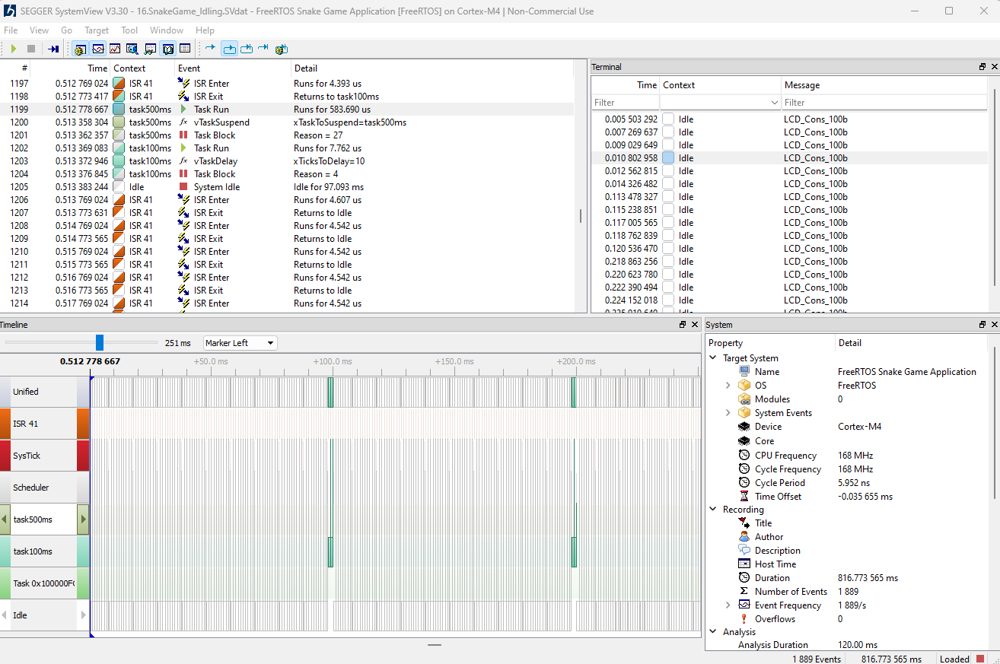
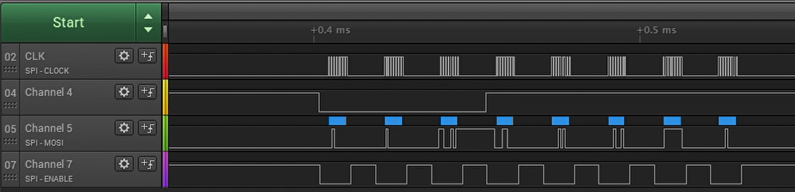
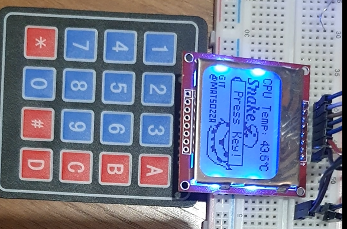

# STM32_SnakeGameNokia

**STM32F4** based implementation of the classic Nokia 5110 **"Snake Game"**. Project based on a **FreeRTOS** platform + some custom drivers and middlewares.

---
**Short video:** Gameplay demo available on Youtube - click to open: 
 

---

The operational system based on FreeRTOS contains two main tasks - **100ms and 500ms.**

The **100ms** task is responsible for running the main applicaton (Snake Game).
The **500ms** task is responsible for updating the upper bar with envrionmental data (CPU Temp., Amb. Temp., Amb. Humidity)

The trace below shows a timeline of the tasks execution:

A LCD service library was developed to provide a higher level optimized API (in terms of memory usage and SPI band usage) to interact wih the device through SPI protocol, as shown below:

The user can interface with the system by using a matricial keyboard, as shown below:

